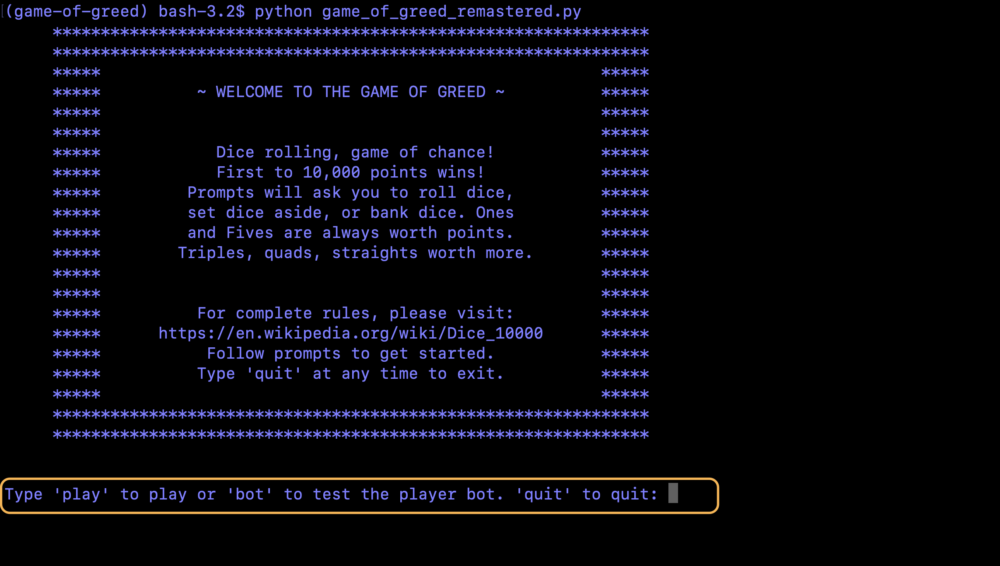

# Game of Greed

**Author**: Stephen Koch
**Version**: 1.1.5

## Overview
The Game of Greed is a game of chance. Also known as Ten Thousand, Zilch or Foo, the game centers around rolling six dice and calculating their values. The first player to 10,000 points is declared the winner. At the start of the game you roll your six dice then calculate the points you rolled. Ones have a value of 100. Fives have a value of 50. The other numbers have no inherant value. 

Three or more of the same number are worth more points. Three of a number is equal to 100 x the face value. More than three of the same number adds an additional tripple value for each aditional over three. Ex: (3,3,3) would yeild 300 points, (3,3,3,3) yeilds 600 points, (3,3,3,3,3) yeilds 900 points, and if every dice is a 3 it would yeild 1200 points!

Straights are worth 1500 points. Straights are considered rolling one of each number: (1,2,3,4,5,6).

Three pairs are also worth 1500 points. Ex: (2,2,3,3,4,4)

Not hitting any value on your first roll gives you one free re-roll. If values are hit on either roll, you can choose to set any of those values aside to add to your total score. Any dice you set aside, can not be re-rolled for additional score. After sucessfully hitting a scoring combination of dice, any dice that are not set aside may be re-rolled for additional points. 

A player may elect to bank their earned points at any time when they have earned them. Banking their points ends the round. Dice go to the next player for their turn. 

Otherwise a player can elect to set aside scoring dice and continue rolling. This can continue for as long as the resulting rolls end in a scoring value. If the additional roll results in a score of zero, ALL points are lost and the round ends.

The longer you wait to bank your earned points, the higher chance you have of losing them all...

Feeling greedy?
## Getting Started

First, make sure that you have python3 installed:
```
$ python3 --version
Python 3.7.5
```
If you do not:
```
$ brew install python
```
You need to have the files locally. Click on the green clone or download button and Download ZIP:


In your command line, navigate to this directory:
```
$ cd ~  ##this is your root directory
$ cd Downloads  ##by default: Downloads is a directory inside of your root; and where your file will be downloaded
$ cd game-of-greed ##and now you are in this directory
```
This is a command line interface game.
To start the game:
```
$ python3 game_of_greed_remastered.py
```
<br>**At the start of the module you will be prompted:**

```
To play:
$ play

To run the player bot:
$ bot

To quit:
$ quit
```
**Player Bot:**
This module includes a player bot designed to make the best choices. By electing to run the player bot, you will see the bot play through 1000 games of greed. Then you can see metrics for how the bot performed.

**Play yourself:**
By electing to play, you will be prompted to select dice to save, reroll what dice you have left, and to bank your dice. After reaching 10,000 points or after 20 rounds, the game will end.

Follow the prompts - And good luck!

## Functionality/Architecture
This game is using 'dice rolls', arguements in the form of tuples. The dice rolls are between 1 and 6 individually and there are six dice at the start of the game. An instance of a GameOfGreed is created upon game start (invoking GameOfGreed class object method play()). 

User is guided through a series of prompts. They can elect to add scoring dice to their side of the table, bank the points that they have set aside, and/or reroll the remaining dice to go for a bigger score.

The player bot is reading every print statement from the game of greed and is looking for two specific prints. The dice roll and the remaining dice. Given, the dice on the table, the bot makes decisions on what the best dice to keep are and whether or not to re-roll.

## Change Log
Mon Dec 09 2019 16:34:04<br>Created Game of Greed Module. Tested for app functionality and correct results.

Tue Dec 10 2019 22:38:07<br>Developed further game functionality. Ability to roll six dice. Added the ability to select dice to set aside, bank the set aside points, calculate a running total, passed user testing. 

Wed Dec 11 2019 22:19:37<br>Devloped flow testing. Ensured proper game flow.

Sun Dec 29 2019 14:09:42<br>Refactored Game of Greed to incorporate a player bot easier. New module, game_of_greed_remastered.py, includes the player bot. Averaging a winning score; 530 points on average per turn.

